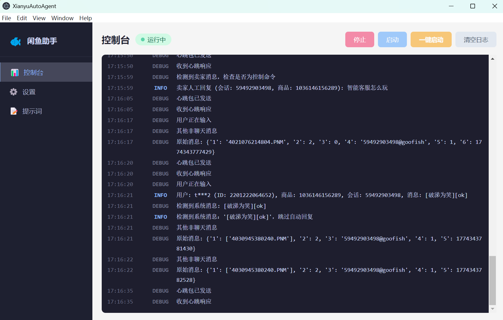

# XianyuAgentPro - 闲鱼智能客服桌面应用

[](https://www.python.org/)
[](https://www.electronjs.org/)
[](https://vuejs.org/)
[](https://dashscope.aliyuncs.com/)

> 基于 [XianyuAutoAgent](https://github.com/shaxiu/XianyuAutoAgent) 改造，升级为 Electron 桌面应用，提供可视化操作界面，实现闲鱼平台 7×24 小时 AI 智能值守。

---

## 🌟 核心特性

| 功能模块 | 说明 |
|----------|------|
| 🤖 多专家 Agent | 意图分类 → 自动路由至议价 / 技术 / 通用客服专家 |
| 💬 上下文感知 | SQLite 存储完整会话历史，对话更连贯 |
| 🖥️ 桌面 GUI | Electron + Vue 3 可视化界面，无需命令行 |
| 🔐 扫码登录 | 内置 Chromium，扫码后自动写入 Cookie，免手动复制 |
| ⚙️ 可视化配置 | 设置页直接修改 API Key、模型、Cookie 等，重启即生效 |
| ✏️ Prompt 编辑器 | 界面内直接修改各专家 Agent 的系统提示词 |
| 🔄 手动/自动模式 | 关键词触发手动接管，超时后自动恢复 AI 值守 |
| 📋 实时日志 | 控制台页面实时展示运行日志，方便排查问题 |

---

## 🎨 效果截图

<div align="center">
  
  <br><em>图1：客服随叫随到</em>
</div>

<div align="center">
  
  <br><em>图2：阶梯式智能议价</em>
</div>

<div align="center">
  
  <br><em>图3：技术专家自动上场</em>
</div>

<div align="center">
  
  <br><em>图4：实时运行日志</em>
</div>

---

## 🚀 快速开始

### 环境要求

| 工具 | 版本要求 |
|------|---------|
| Python | 3.8+ |
| Node.js | 18+ |
| npm | 9+ |

### 一、克隆并安装依赖

```bash
# 1. 克隆仓库
git clone https://github.com/your-username/XianyuAgentPro.git
cd XianyuAgentPro

# 2. 安装 Python 依赖
pip install -r python/requirements.txt

# 3. 安装 Playwright 浏览器（扫码登录所需）
playwright install chromium

# 4. 安装 Electron 依赖
cd electron
npm install
```

### 二、启动开发模式

```bash
# 在 electron/ 目录下运行，同时启动 Vite + Electron，支持热更新
cd electron
npm run dev
```

### 三、首次配置

启动后在应用「设置」页面填写以下内容：

| 配置项 | 说明 | 默认值 |
|--------|------|--------|
| **API Key** | LLM 平台 API Key（通义千问等） | 必填 |
| **Cookie** | 闲鱼网页端 Cookie | 必填（或扫码登录） |
| 模型地址 | LLM API 接入点 | `https://dashscope.aliyuncs.com/compatible-mode/v1` |
| 模型名称 | 使用的模型 | `qwen-max` |

**推荐方式：扫码登录**
点击控制台页面「扫码登录」按钮，自动弹出 Chromium 浏览器，扫码后 Cookie 自动写入，无需手动复制。

---

## 📦 打包发布（Windows）

### 方式 A：一键全量打包

```bat
scripts\build-all.bat
```

构建产物位于 `build/` 目录：

```
build/
├── python-dist/bridge/          # PyInstaller 打包的 Python 可执行文件
├── electron-dist/win-unpacked/  # Electron 解包目录
└── installer-output/            # Inno Setup 生成的安装包 .exe
```

> Inno Setup 需单独安装：[Inno Setup 6](https://jrsoftware.org/isdl.php)，脚本会自动检测路径。

### 方式 B：分步打包

```bat
# Step 1：PyInstaller 打包 Python bridge
scripts\build-python.bat

# Step 2：构建前端
cd electron
npm run build:renderer

# Step 3：electron-builder 打包
npm run build:electron

# Step 4：Inno Setup 制作安装包（需已安装 Inno Setup 6）
"C:\Program Files (x86)\Inno Setup 6\ISCC.exe" installer\setup.iss
```

---

## 🏗️ 项目结构

```
├── electron/               # Electron 桌面应用
│   ├── main/               # 主进程（index.js / pythonManager.js / ipcHandlers.js / dbManager.js）
│   ├── preload/            # 预加载脚本
│   ├── renderer/           # Vue 3 前端界面（Vite）
│   └── package.json
├── python/                 # Python 后端
│   ├── bridge.py           # Electron ↔ Python IPC 桥接入口
│   ├── main.py             # WebSocket 连接与消息路由
│   ├── XianyuAgent.py      # LLM 回复生成与专家路由
│   ├── XianyuApis.py       # 闲鱼平台 HTTP API 封装
│   ├── context_manager.py  # 会话上下文管理（SQLite）
│   ├── config_manager.py   # 配置与提示词管理（SQLite）
│   └── utils/
│       └── xianyu_utils.py # 工具函数（Cookie、签名、加解密）
├── scripts/                # 构建脚本
├── installer/              # Inno Setup 安装包配置
└── images/                 # 截图资源
```

---

## ⚙️ 高级配置

所有配置项均通过应用「设置」页面修改，存储于 SQLite 数据库（`%APPDATA%\XianyuAutoAgent\app_config.db`）：

| 配置项 | 说明 | 默认值 |
|--------|------|--------|
| `TOGGLE_KEYWORDS` | 触发手动/自动模式切换的关键词 | `。`（中文句号） |
| `SIMULATE_HUMAN_TYPING` | 是否模拟人工打字延迟 | `False` |
| `HEARTBEAT_INTERVAL` | WebSocket 心跳间隔（秒） | `15` |
| `TOKEN_REFRESH_INTERVAL` | Token 自动刷新间隔（秒） | `3600` |
| `MANUAL_MODE_TIMEOUT` | 手动模式持续时长（秒） | `3600` |
| `MESSAGE_EXPIRE_TIME` | 消息有效期（毫秒） | `300000` |

---

## 🔧 常见问题

**Q：Cookie 失效怎么办？**
在「设置」页面点击「扫码登录」重新获取，或手动打开 [goofish.com](https://www.goofish.com) 复制 Cookie 粘贴到设置中。

**Q：消息没有自动回复？**
查看控制台日志，确认消息通过了过滤器，并检查意图分类结果与所选 Agent。

**Q：LLM 回复质量不佳？**
前往「Prompt」页面修改各专家 Agent 的系统提示词，无需重启即可生效。

**Q：WebSocket 频繁断开？**
属于正常的 Token 刷新重连，日志中出现「Token刷新成功」表示连接已恢复。

---

## 🤝 参与贡献

欢迎通过 Issue 提交反馈，或 Pull Request 贡献代码。

---

## 🛡️ 免责声明

> ⚠️ 本项目基于 [XianyuAutoAgent](https://github.com/shaxiu/XianyuAutoAgent) 二次开发，仅供学习与交流使用。请勿用于商业用途，如有侵权请联系作者删除。开发团队保留随时停止更新或删除项目的权利。
